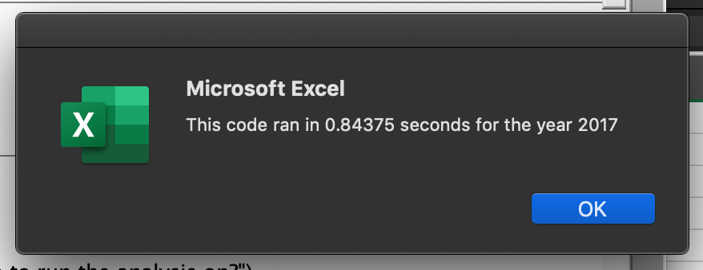
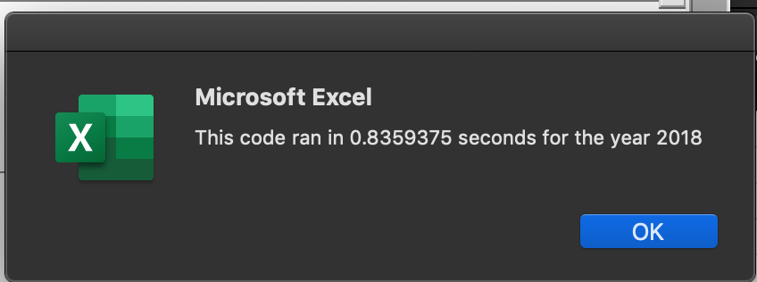
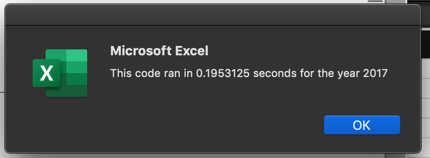

# Green Stock Analysis
---
## Purpose
---
  We wanted to refactor the code we made for a small sample of stocks to enable it to work faster and more effeciently for larger data sets that include stock prices for the entire stock market over the last few years.

## Overview
---
  We originally made a code that worked to show the total volume and return on stocks purchased of 12 stocks. This VBA code worked well and ran in less than a second as shown below.

  When refactoring the code we first needed to add a new variable to represent the tickers as they related to the ticker Index. We set it as an integer to allow for a loop. With in each loop we added total volume, starting price, and ending price then stored them as seperate variables for each ticker Index. A Challenge when running a for loop to look though the data set, was to set each loop to the new index. We were able to do this by adding an additional step to the last if then statement. As a result our code was able to run faster.

*We can see the results of the code below*

## Summary
---
  The original code runs through all the rows before moving on to the next ticker index which requires more memory and ram. Whenever new data is added to the data set we will need to update the code to reflect new tickers and update the number.
  The refactored code runs through one ticker index value starting at 0 then determines the total volume, the starting price, and the ending price before adding one to the ticker index number and using the new number as a representative of the new ticker index thus moving through the loop rather than looping through the data set.
	The code is able to run faster and be used for larger data sets because it is not wasting time going through the entire data set for 11 times. The drawback of this code though is the need to add new tickers to the list of ticker Index when there is new data added. We will also need to add the appropriate number of arrays strings and for loops.
